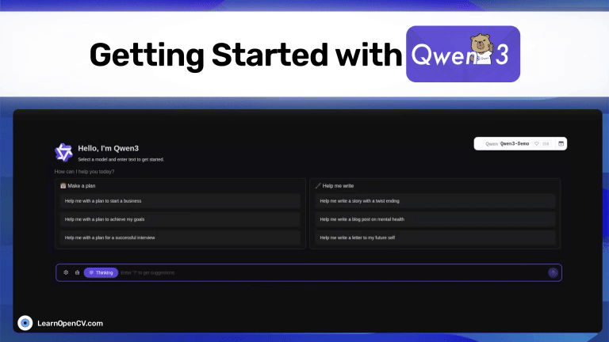

# Getting Started with Qwen3 – The Thinking Expert

This repository contains the Python scripts to run the Inference.   

It is part of the LearnOpenCV blog post - [Getting Started with Qwen3 – The Thinking Expert](https://learnopencv.com/qwen3/).

### Run Inference

Use the ``ollama_qwen3_inf.ipynb`` and ``app.py`` file to run the inference.

## AI Courses by OpenCV

Want to become an expert in AI? [AI Courses by OpenCV](https://opencv.org/courses/) is a great place to start.

