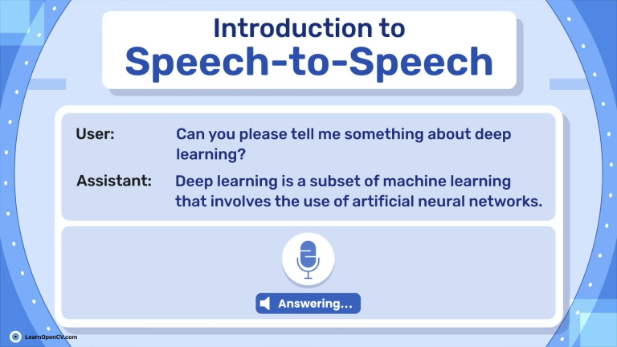

## Introduction to Speech to Speech: Most Efficient Form of NLP

This repository contains the Notebook file and Python scripts to run the Inference.   

It is part of the LearnOpenCV blog post - [Introduction to Speech to Speech: Most Efficient Form of NLP](https://learnopencv.com/speech-to-speech/)

[]()



### Run Inference

##### Clone the **speech to speech** repository into your local directory:
```bash
git clone https://github.com/huggingface/Speech to Speech.git
cd Speech to Speech
```
##### Follow the Environment setup process described in article.

##### Run the ``pipeline`` in your python environment:
```bash
python s2s_pipeline.py  --recv_host 0.0.0.0  --send_host 0.0.0.0  --lm_model_name meta-llama/Llama-3.2-1B-Instruct --stt_compile_mode reduce-overhead  --tts_compile_mode reduce-overhead
```
##### Then start the ``client``:
```bash
python listen_and_play.py --localhost
```

## AI Courses by OpenCV

Want to become an expert in AI? [AI Courses by OpenCV](https://opencv.org/courses/) is a great place to start.

[](https://opencv.org/courses/)
